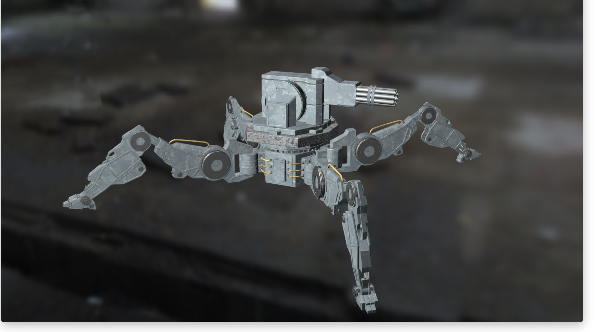

# Descrizione Generale
Il nostro progetto prevede il rendering di un robot da guerra. L'utente ha la possibilità di visualizzare il robot in una versione "appena uscito da fabbrica" e una con i metalli arruginiti. Tuttavia abbiamo pensato che alcune parti costruite idealmente con metalli cromati non debbano arrguginire e rimangano pertanto invariati nelle due visualizzazioni. Il robot presenta inoltre una base in roccia per attenuare il rinculo degli spari e dare maggior stabilità. Anch'esso infatti viene visualizzato in una versione "pulita" e una versione invecchiata, sporca e con del muschio.




# Struttura del progetto
- da ```index.html``` si accede al risultato finale del progetto
- ```journal.md``` una raccolta di tutti gli step fatti per la realizzazione del progetto
- ```./images``` contiene le immagini inserite in questo file, nel journal, le EM e le IEM
- ```./lib``` contiene le librerie di threejs e tweenjs
- ```./model``` contiene i modelli 3D di ogni parte del robot e le relative texture

# Fasi di implementazione
- Ricerca modello
- Scomposizione parti modello con Maya
- Assemblaggio parti nella scena
- Ricerca texture diffusive ed esportazione texture adattate ai modelli con Blender
- Inserimento luci, EM e IEM
- Tween delle gambe e rotazione mitragliatrice
- Rimplementazione controlli e fissaggio luci solidali alla camera.
- Realizzazione struttura del sito e inserimento scena


# Future features da implementare
- Aggiungere altri materiali
- Implementare un particle system per simulare i proiettili che escono dalle canne della mitragliatrice
