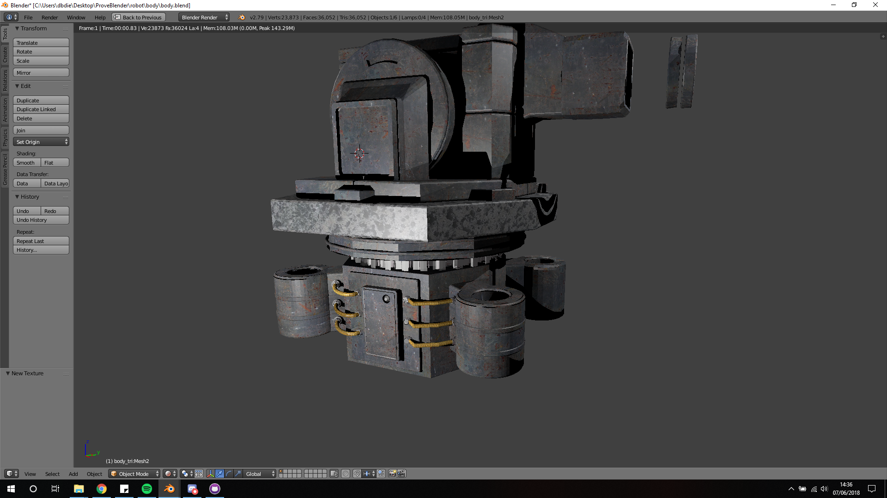
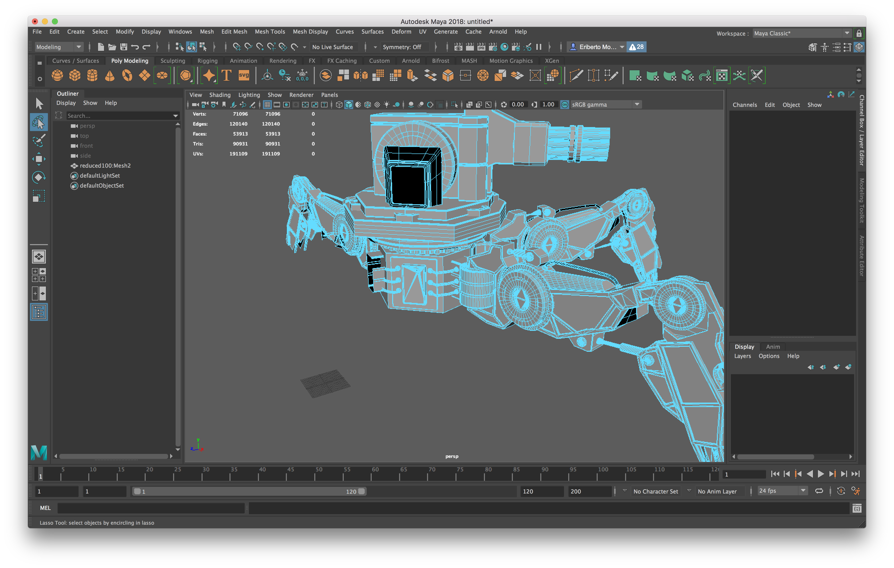

## Jun 9, 2018
- Problema: non riusciamo a esportare normali e specular soddisfacenti con Blender.  Le normali che esportiamo ci sembrano troppo piatte e variando la loro intensità con un parametro NormalScale in Threejs non otteniamo un risultato realistico. Le specualari invece sono troppo bianche. Soluzione: importiamo nel sito http://cpetry.github.io/NormalMap-Online/ la diffuse già adattata al modello (con la forma ritagliata  da Blender) ed estriamo la normale e la specular. Siamo consapevoli che questo procedimento non è consigliabile ma il risultato ci sembra molto buono e con il poco tempo che ci rimane decidiamo di accettare il risultato.
- Modifichiamo con photoshop la specular modificando luminosità e contrasto per ottenere il grado di riflesso che ci sembra più opportuno.
- Partendo dalle specular le modifichiamo con photosohop per ottenere delle roughnessMap.

## Jun 8, 2018
- Scelta una EM più accurata e aggiunta alla scena
- Implementazione rotazione delle canne della mitragliatrici
- Posizionamento luce nella scena
- Gestione luci multiple
- Aggiunte texture AO
- Inizio imlmentazione della struttuta HTML per la cornice dell'ECommerce

## Jun 7, 2018
- Perfezionamento tweens: scelta easing più appropriato.
- Assemblaggio robot completo di gambe, cannoni e movimenti.
- Fix del movimento alternato delle gambe.
- Editing delle texture con Blender. Problemi con le normali e le specular.

## Jun 6, 2018
- Finiamo l'estrazione di tutte le parti del corpo del robot. Inizamo con l'assemblaggio in Threejs.
- Threejs ha difficoltà a renderizzare qualche faccia del robot. Ci accorgiamo che le faccie che non vengono renderizzate non sono triangoli. Rimodelliamo con Maya ogni componente del robot applicandogli una funzione per triangolare il modello.
- Scopriamo il sito http://cpetry.github.io/NormalMap-Online/ che ci permette di estrarre NormalMap, DisplacementMap, AOMap e SpecularMap, dando in input la diffuse. 
- Abbiamo ancora il problema che le nostre texture sono rettangolari. Non sono fatte a misura del robot.
- Con Blender abbiamo il primo successo. Abbiamo capito come esportare qualsiasi tipo di texture con la "forma" che calzi sul nostro modello.
- Iniziano le prime prove di inserimento di texture (per ora solo la diffuse) esportate da Blender.
- Raccogliamo varie possibili texture diffusive in internet da applicare.
- Siamo speranzosi e pensiamo di poter finire in tempo e senza limitazioni il nostro progetto. Iniziamo quindi a studiare le animazioni e decidiamo di usare la libreria tweenjs per animare la camminata del robot.
- Riusciamo di già a ottenere un discreto risultato con i nostri primi tween.

## Jun 5, 2018
- Continua la fase di estrazione delle parti del robot con Maya
- Iniziamo intanto a studiare anche Blender per trovare delle possibili texture per il nostro robot.

## Jun 4, 2018
- Facciamo anche qualche prova di inserimento EM e IEM su un file di test a parte.
- Nel frattempo con Maya riusciamo a montare senza sforzi il modello del robot definitivo senza dover maneggiare ogni sua componente. Riusciamo a esportarlo come un unico oggetto assemblato e troviamo una funzione in Maya che ci permette di semplificare il modello togliendo un numero prestabiliti di vertici. Non otteniamo un risultato eccellente ma ci accontentiamo, ora il nostro modello conto 99.999 vertici. 
- Ci poniamo il problema che a questo punto, dato che abbiamo un oggetto unico fissato e statico non saremo più in grado di spostare determinate sue parti per una possibile animazione.
- La soluzione la troviamo modellandolo con Maya. Dobbiamo esportare come un oggetto a sè stante ogni sua parte di cui prevediamo un movimento indipendente dal resto del corpo. Da qui inizierà una lunga fase di pazienza per isolare: le canne, il copro centrale e ben quattro componenti della gamba. A seguito uno screenshot di questa fase:

## Jun 3, 2018
- Decidiamo di procedere, per il momento, all'implementazione parallela del robot e del drago. Non abbiamo idea del lavoro che ci richiederà il robot e in ogni caso se non riusciamo ad implementare un'animazione al robot, il drago ci sembra un modello più interessante. Meglio avere un secondo progetto di scorta.
- Ci accorgiamo che il robot ha circa 270 mila vertici (non rispetta i requisiti del progetto) e threejs non lo vede come un oggetto unico bensì come circa 200 oggetti (non allineati!) che compongono il robot finale.
- Iniziamo a studiare Autodesk Maya per trovare qualche soluzione...

## Jun 2, 2018
- Troviamo una serie di oggetti interessanti. In particolare: un dinosauro, un drago e un robot.
- Sebbene il drago e il dinosauro non ci sembrino "products" adatti come richiesto da consegna pensiamo che possiamo trovare rimedio spacciandoli per modellini da soprammobile. Effettivamente questi due modelli sono ben costruiti e dispongono già di molte texture interessanti (normale, specular, ao, ...).
- Il robot è anch'esso ben costruito. Ha molti particolari come una mitragliatrice "gatling" e ha 4 gambe robotiche. Ci viene subito in mente che sarebbe bello animarlo facendolo camminare e facendo girare le canne della mitragliatrice. Sfortunatamente però il modello non dispone di alcuna texture. Non abbiamo idea di come potremo ricavarcele...

## Jun 1, 2018
- Cominciamo ad cercare in internet qualche modello 3D